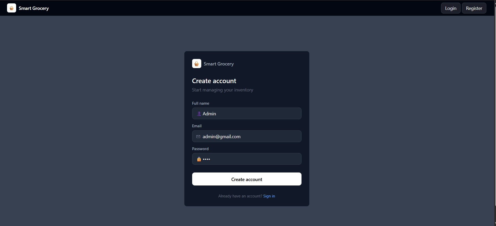
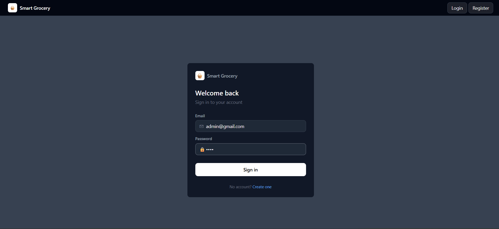
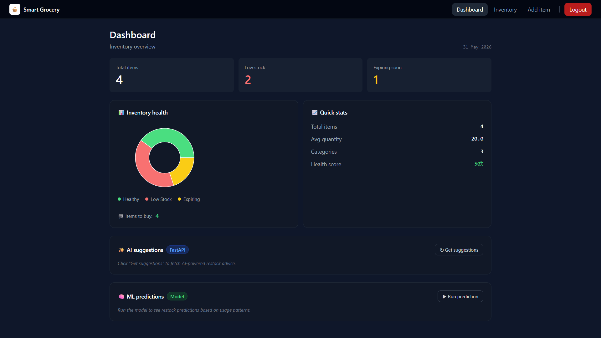
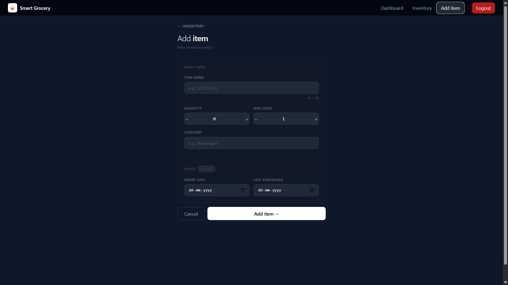
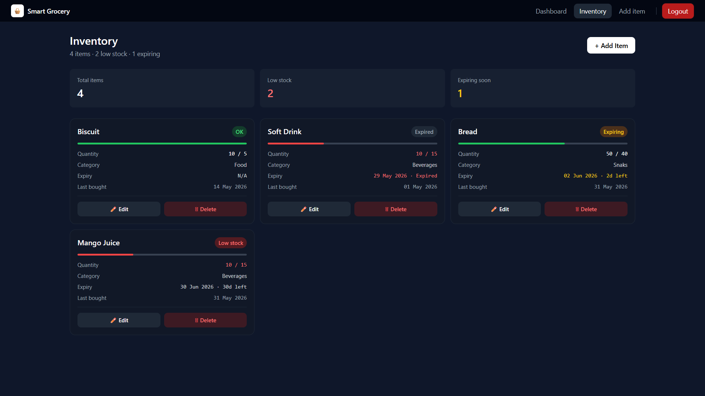
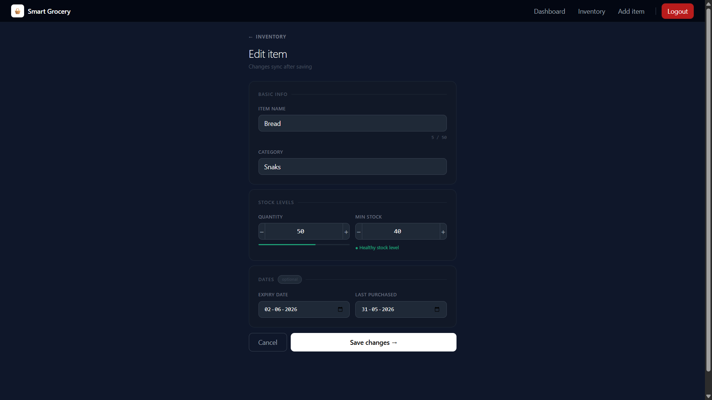
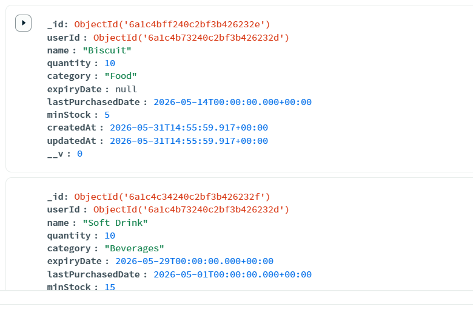

# Smart Grocery List & Inventory Manager

A full-stack web application for managing grocery inventory with real-time alerts, stock insights, and AI-powered prediction support. It helps users track pantry items, identify low-stock or expiring groceries, and request smart suggestions from a FastAPI AI engine.

## Tech Stack

- **Frontend**: React 19 + Vite + Tailwind CSS + Recharts
- **Backend**: Node.js + Express 5 + MongoDB + Mongoose
- **AI Engine**: FastAPI + Python + scikit-learn
- **Authentication**: JWT (JSON Web Tokens)
- **Deployment**: Docker + Docker Compose

## Features

- User authentication (Register/Login)
- Add, view, edit, and delete grocery items
- Real-time low stock and expiration alerts
- Inventory dashboard with visual charts
- Category-based organization
- AI usage prediction from inventory history
- AI recommendation-ready architecture
- PWA support

## Setup Instructions

### Prerequisites

- Node.js 20+ or Docker
- Python 3.10+
- MongoDB (local or Docker)
- npm

### Local Development

#### 1. Clone and Install Dependencies

```bash
# Install server dependencies
cd server
npm install

# Install client dependencies
cd ../client
npm install

# Install AI engine dependencies
cd ../ai-engine
pip install -r requirements.txt
cd ..
```

#### 2. Environment Configuration

Create `.env` file in the root directory:

```env
PORT=5000
MONGO_URI=mongodb://localhost:27017/grocery
JWT_SECRET=your_super_secret_jwt_key_change_this_in_production
CLIENT_URL=http://localhost:5173
NODE_ENV=development
```

Client `.env.local` (already provided):

```env
VITE_API_URL=http://localhost:5000/api
VITE_AI_API_URL=http://localhost:8000
```

#### 3. Start MongoDB

**Option A: Local MongoDB**
```bash
mongod
```

**Option B: Docker**
```bash
docker run -d -p 27017:27017 --name grocery_mongo mongo:7
```

#### 4. Start Development Servers

**Terminal 1 - Backend:**
```bash
cd server
npm run dev
```

**Terminal 2 - Frontend:**
```bash
cd client
npm run dev
```

**Terminal 3 - AI Engine:**
```bash
cd ai-engine
python -m uvicorn app:app --reload --port 8000
```

Access the app at `http://localhost:5173`

### Docker Deployment

```bash
# Build and run all services
docker-compose up --build

# Run in background
docker-compose up -d

# Stop services
docker-compose down
```

Access at `http://localhost:5173`

## Environment Variables

### Server (.env)

| Variable | Default | Description |
|----------|---------|-------------|
| `PORT` | `5000` | Server port |
| `MONGO_URI` | `mongodb://localhost:27017/grocery` | MongoDB connection string |
| `JWT_SECRET` | `required` | Secret key for JWT signing |
| `CLIENT_URL` | `http://localhost:5173` | Frontend URL for CORS |
| `NODE_ENV` | `development` | Environment mode |

### Client (.env.local)

| Variable | Default | Description |
|----------|---------|-------------|
| `VITE_API_URL` | `http://localhost:5000/api` | Backend API URL |
| `VITE_AI_API_URL` | `http://localhost:8000` | FastAPI AI engine URL |

### AI Engine

```bash
cd ai-engine
python -m uvicorn app:app --reload --port 8000
```

## Available Scripts

### Server

```bash
npm run dev      # Start with nodemon (auto-reload)
npm start        # Start production server
npm test         # Run tests (if configured)
```

### Client

```bash
npm run dev      # Start Vite dev server
npm run build    # Build for production
npm run preview  # Preview production build
```

## API Routes

### Authentication

| Method | Route | Description |
|--------|-------|-------------|
| POST | `/api/auth/register` | Register new user |
| POST | `/api/auth/login` | Login user |

### Items (Protected - requires JWT token)

| Method | Route | Description |
|--------|-------|-------------|
| GET | `/api/items` | Get all user items |
| POST | `/api/items` | Create new item |
| PUT | `/api/items/:id` | Update item |
| DELETE | `/api/items/:id` | Delete item |

### AI

| Method | Route | Description |
|--------|-------|-------------|
| POST | `/api/ai/predict` | Express AI prediction proxy |
| GET | `http://localhost:8000/` | AI engine health check |
| POST | `http://localhost:8000/predict` | Predict usage from history data |

## Project Structure

```
.
├── client/                 # React frontend
│   ├── src/
│   │   ├── components/    # Reusable UI components
│   │   ├── context/       # React context (Auth)
│   │   ├── hooks/         # Custom hooks
│   │   ├── pages/         # Page components
│   │   ├── services/      # External service clients
│   │   └── utils/         # API client, helpers
│   └── package.json
├── server/                 # Express backend
│   ├── config/            # Database config
│   ├── controllers/        # Route handlers
│   ├── middleware/         # Auth middleware
│   ├── models/            # Mongoose schemas
│   ├── routes/            # API routes
│   ├── services/          # AI/helper service logic
│   ├── utils/             # Helper functions
│   └── package.json
├── ai-engine/              # FastAPI AI service
│   ├── model/             # Prediction model helpers
│   ├── app.py             # FastAPI entry point
│   └── requirements.txt
├── docker-compose.yml      # Docker orchestration
└── .env.example           # Environment template
```

## Screenshots

### 🟢 Register



### 🟢 Login



### 🟢 Dashboard



### 🟢 Add-item



### 🟢 Inventory-list



### 🟢 Edit-item



### 🟢 Mongodb-data




## Troubleshooting

### Cannot connect to MongoDB

```bash
# Check if MongoDB is running
mongosh

# If using Docker
docker ps | grep mongo
```

### API calls failing with 401

- Ensure token is saved in localStorage after login
- Check `MONGO_URI` and `JWT_SECRET` in `.env`
- Verify backend is running on correct port

### Port already in use

```bash
# Kill process on port 5000 (Linux/Mac)
lsof -ti:5000 | xargs kill -9

# Or change PORT in .env
```

## Production Deployment

1. Update `.env` with production values
2. Change `JWT_SECRET` to a strong random string
3. Set `NODE_ENV=production`
4. Use `docker-compose up` for full containerized deployment
5. Consider using a reverse proxy (Nginx/Apache)
6. Enable HTTPS with SSL certificates

## Security Notes

- Never commit `.env` files
- Change default `JWT_SECRET` before deployment
- Use environment variables for sensitive data
- CORS is restricted to specified `CLIENT_URL`
- All item endpoints require authentication

## 👨‍💻 Author

Amiya Krishna Chaurasiya

B.Tech CSE Student

Aspiring Data Scientist and AI/ML Engineer

GitHub: https://github.com/Amiya-Krishna

LinkedIn: https://www.linkedin.com/in/amiya-krishna

## ⭐ Support

If you like this project:

⭐ Star the repository
🍴 Fork it
🤝 Contribute

